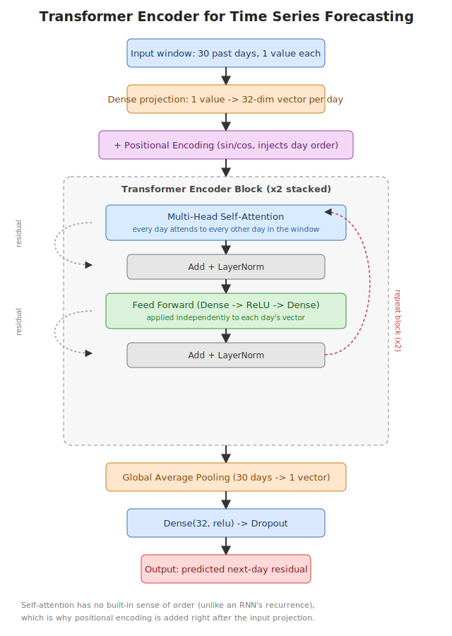

# Transformer for Time Series Forecasting

A Transformer encoder built **from scratch** in TensorFlow/Keras (positional encoding + multi-head self-attention, no external Transformer library) to forecast a synthetic daily time series, then used to predict multiple years ahead.

This notebook is a from-first-principles walkthrough — every line is commented, including the NumPy mechanics (broadcasting, `np.newaxis`, etc.) behind positional encoding.

---

## Why Transformers (and RNNs) beat classical forecasting methods

Classical methods like ARIMA, exponential smoothing, or linear regression on lagged features work well when a series is roughly linear/stationary and its seasonality is known in advance — but they need that structure specified by hand, and they don't learn non-linear patterns from the data.

**RNN / LSTM / GRU** fix that: they learn temporal patterns automatically and process the sequence in the order it happened, one step at a time, carrying a hidden state forward. That's a natural fit for time series. Two limitations:
- **Vanishing/exploding gradients** — information from far in the past gets diluted as it's carried forward step by step, so very long-range dependencies are hard to learn.
- **Sequential computation** — step *t* can't be computed until step *t-1* is done, so training can't be parallelized across the time dimension. This makes RNNs slow on long sequences.

**Transformers** address both:
- **Self-attention** lets every time step look directly at every other time step in one operation — a dependency 200 days back is exactly as "reachable" as one 2 days back, no gradual dilution.
- **Parallelizable** — because attention doesn't require processing step 1 before step 2, all time steps in a window are processed simultaneously during training, which is much faster on GPUs.
- **Multi-head attention** lets the model track several different kinds of temporal relationships at once (e.g. weekly rhythm and long-term drift, learned as separate "heads").

Trade-off: attention has **no built-in sense of order** (unlike an RNN's recurrence, which is inherently sequential), so Transformers need an explicit **positional encoding** added to the input. They also tend to need more data than an RNN to learn patterns, since they don't have that recurrence built in as a shortcut.

| | Classical (ARIMA etc.) | RNN / LSTM / GRU | Transformer |
|---|---|---|---|
| Learns non-linear patterns | ✗ (needs manual feature engineering) | ✓ | ✓ |
| Long-range dependencies | Limited | Weak (vanishing gradient) | Strong (direct attention) |
| Training speed (long sequences) | Fast (simple math) | Slow (sequential steps) | Fast (parallel across time) |
| Needs order injected explicitly | N/A | No (built into recurrence) | Yes (positional encoding) |
| Data required | Low | Medium | Higher |

---

## Pictorial explanation of the Transformer used here

The model is an **encoder-only** Transformer (no decoder — this is a regression/forecasting task, not sequence generation):

1. **Input window** — the last 30 days, 1 value each (the detrended, scaled residual — see below).
2. **Dense projection** — each day's single number is projected up into a 32-dimensional vector, giving attention more room to encode patterns.
3. **+ Positional encoding** — fixed sine/cosine signals added on top, so the model knows which day is which.
4. **Transformer encoder block (stacked twice)**:
   - **Multi-head self-attention** — every day attends to every other day in the window.
   - **Add + LayerNorm** — residual connection + normalization for stable training.
   - **Feed-forward network** — a small Dense→ReLU→Dense applied independently to each day's vector.
   - **Add + LayerNorm** — another residual connection + normalization.
5. **Global average pooling** — collapses the 30 per-day vectors into a single vector.
6. **Dense head** — a small MLP that outputs one number: the predicted next-day residual.

---

## Why the series is detrended first

The synthetic data has a **linear upward trend**. Neural networks (Transformers included) don't extrapolate trends well beyond what they saw during training — if you scale the raw values with `MinMaxScaler`, future/test values fall outside the learned range and the model's predictions plateau or drift instead of continuing the trend.

**Fix used here:** fit a straight line to the trend using only the training portion (to avoid leakage), subtract it to get a stationary residual (seasonality + noise), train the Transformer on *that*, then add the (extrapolated) trend back after predicting.

## Pipeline

1. Generate a synthetic daily series: trend + weekly seasonality + yearly seasonality + noise
2. Detrend (fit line on train portion only, subtract to get residual)
3. Scale the residual to [0, 1] (`MinMaxScaler`, fit on train portion only — no leakage)
4. Build sliding windows: 30 past days → next day
5. Chronological train/test split (no shuffling)
6. Build and train the Transformer encoder
7. Evaluate on the test set (reconstruct real values: residual + trend)
8. Recursive multi-step forecast: predict one step, feed it back in, repeat — then add the extrapolated trend back

## Requirements

- tensorflow
- numpy
- pandas
- scikit-learn
- matplotlib

## Usage

Open [Transformer.ipynb](Transformer.ipynb) in Jupyter or VS Code and run the cells in order. The data is synthetic and generated in the notebook itself — no external dataset needed.
